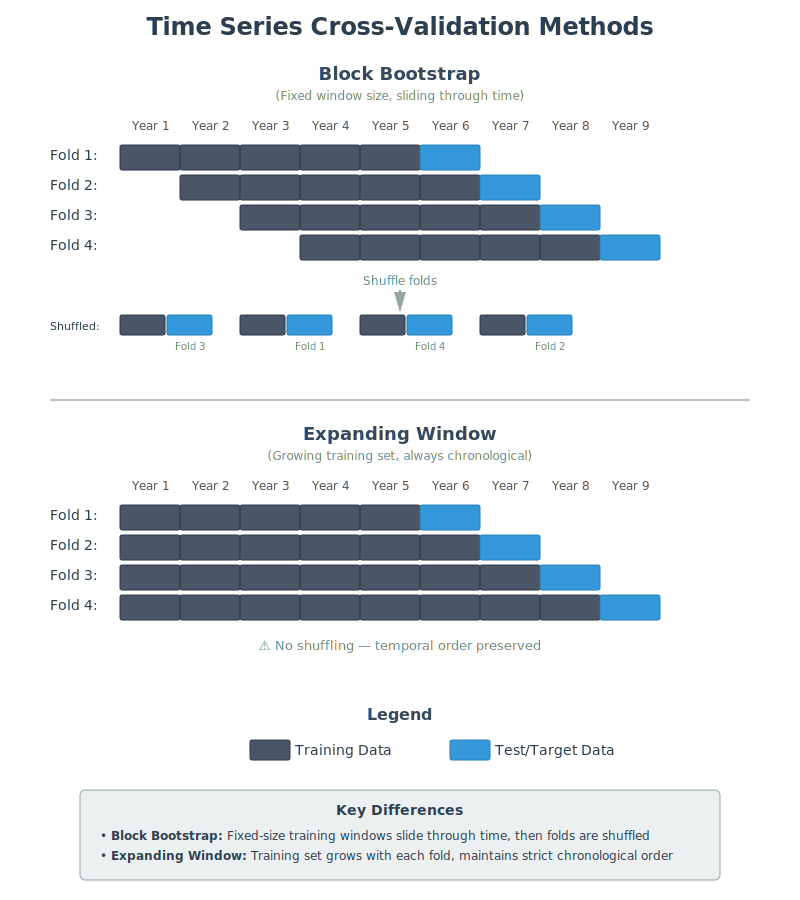

# 1.2 What Makes Time Series Analysis Unique?

Time series analysis has multiple important differences from most of data science that necessitate unique methodologies. This section covers a few of the most important.

## Temporal Ordering

 If you take nothing else away from this book, please take away this warning:
```{warning} Temporal Ordering
The temporal ordering of a time series must always be maintained, and predictions must always be from past observations to future ones.
```
One important ramification of the above is that standard data science resampling techniques such as bootstrapping are not valid. Bootstrapping is clearly invalid as shuffling the observations will destroy any trends present in the data. Standard cross-validation techniques are also problematic as they do not guarantee we will not predict the past based on the future. One variation that can be used is the *block bootstrap*, in which we train our model on a given number of training and target observations, say years $1-5$ for training to predict year $6$, years $2-6$ to predict $7$, etc. Variations include the *expanding window bootstrap* in which we train on a given block, again say $1-5$ and use year $6$ as the target observation, then train on $1-6$ and use $7$ as the target, and so on.



## Serial Correlation

As mentioned in [the previous section](01_time_series.md), an important aspect—arguably the *central* aspect—of time series is the serial correlation. Beyond the [temporal ordering mentioned above](02_characteristics.md#temporal-ordering), this also results in the assumption of *independent and identically distributed* (iid) being invalid. Time series will usually violate the first "i" (independence), later chapters will discuss models for time series that also violate the "id" (identical distribution) as well.

The lack of iid means that we cannot rely on many of the hypothesis tests we're used to in broader data science such as ANOVA and t-tests (at least not on the raw data). However, after covering autocovariance and autocorrelation, we will see that the same lack of independence gives us powerful tools for time series analysis.

## Non-Necessity of Features

Another aspect differentiating time series analysis from broader data science is the ability to generate predictions without features, or as they tend to be known in time series analysis *exogenous variables*. Given a single univariate time series, say historical stock prices or infection rates, it is perfectly reasonable to ask what we expect future values to be.

Indeed, we will spend most of the first half of this book dealing exclusively with univariate time series in which the same variable is both the feature and the target. Later chapters will introduce models such as ARIMAX that incorporate additional features.

## Time Series as Processes

Many data science use cases involve target variables that are inherently discrete from each other. For example, the set of patients for whom we're predicting the risk of a disease given their blood work is inherently discrete by individual. On the other hand, the target variables in time series analysis are usually understood to be samples of an underlying continuous *process* taken at discrete intervals. 

For example, it is not reasonable to ask "What is the disease risk of patient $1.5$?". In contrast, given the temperature at time $t=1$ and $t=2$, it is perfectly reasonable to interpolate the temperature at time $t=1.5$. Using discrete samples to try to understand continuous processes can be the source of great confusion and consternation among data scientists, electrical engineers, and any other discipline concerned with *signal processing*. 

A particular concern is *aliasing*, in which an excessively low sampling rate can introduce spurious patterns into the data.
```{figure} images/sampling_no_aliasing.png
---
width: 95%
name: sampling-without-aliasing
---
Sampling correctly reproducing the original signal.
```

```{figure} images/sampling_with_aliasing.png
---
width: 95%
name: sampling-with-aliasing
---
Sampling exhibiting aliasing distorting the reconstructed signal.
```

:::{tip} Problem
Music is often sampled at around $44.1$ kHz, despite the fact that the maximum frequency perceptible by humans is around $15-20$ kHz. Why is this high sampling rate necessary? You may want to revisit this question after reading the chapter on Fourier analysis.
:::

Interestingly, the exact same phenomenon can occur in images, where it is responsible for the *Moiré effect*. The Moiré effect often arises due to jpeg compression of highly textured images. Ultimately, the cause is the same as with time series; sampling a continuous scene with too few discrete pixels introduces spurious patterns. 

```{figure} images/bricks_with_moire.png
---
width: 95%
name: bricks-with-moire
---
Original image (left) and image after jpeg compression (right) exhibiting Moiré patterns (images from [Wikipedia](https://en.wikipedia.org/wiki/Aliasing) used under CC BY-SA 3.0 license).
```